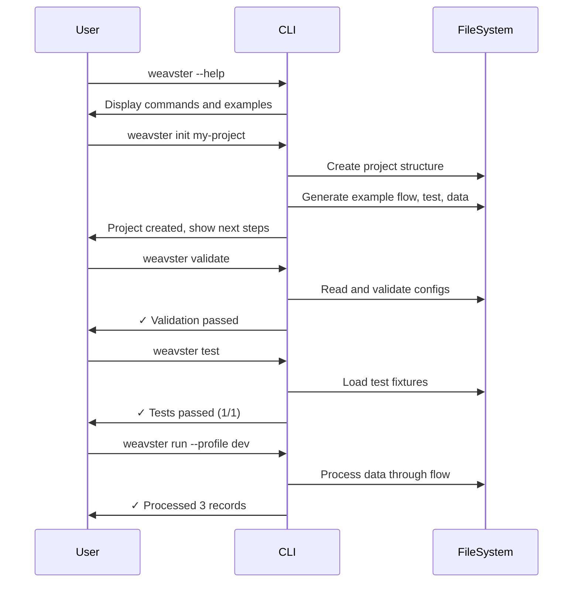
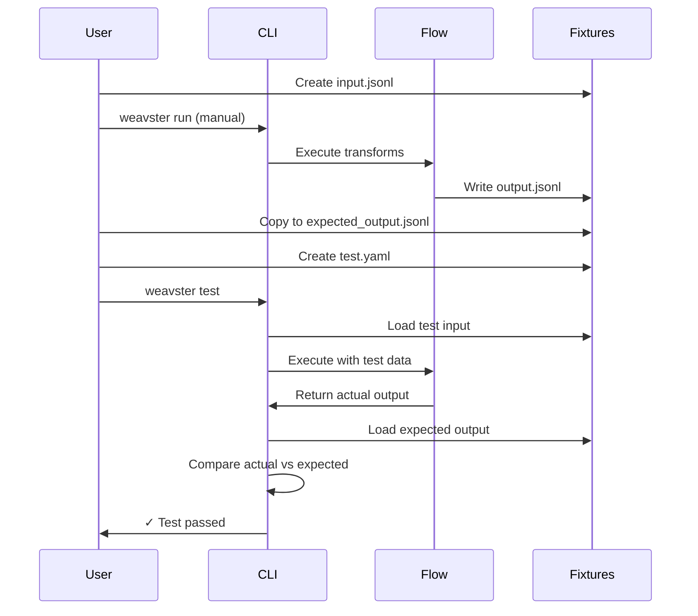

# Core Flows: Weavster Developer Experience

## Overview

This document defines the core user flows for Weavster, designed around a dbt-like developer experience with LLM-friendliness as the primary design constraint. All flows prioritize clear file structure, predictable patterns, comprehensive CLI feedback, and local-first development.

## Design Principles

1. **LLM-Friendly First** - Clear conventions, consistent patterns, comprehensive help text
2. **Local-First Development** - Fast feedback loops, no external dependencies (SQLite for dev)
3. **File-Based Testing** - All tests use file fixtures, regardless of production connectors
4. **Hierarchical Configuration** - Global defaults with flow and transform overrides
5. **Composability** - Flows, connectors, and macros are reusable and extensible

---

## Flow 1: First-Time User Onboarding

**Description:** A developer's first experience with Weavster, from installation to running their first flow.

**Entry Point:** User has installed the Weavster binary

**Steps:**

1. User runs `weavster --help` to explore available commands
   - CLI displays comprehensive help with examples
   - Guides user to `weavster init` as the starting point

2. User runs `weavster init my-project`
   - Creates project directory with standard structure
   - Generates example flow with single transform
   - Creates sample input data and test case
   - Displays next steps: validate, test, run

3. User explores the generated project structure:
   ```
   my-project/
   ├── weavster.yaml          # Project config
   ├── flows/
   │   └── example_flow.yaml  # Simple example flow
   ├── connectors/
   │   └── file.yaml          # File connector configs
   ├── macros/                # Reusable transform snippets
   ├── tests/
   │   ├── example_test.yaml  # Test definition
   │   └── fixtures/          # Test input/output files
   └── data/
       └── input.jsonl        # Sample data
   ```

4. User runs `weavster validate` to check configuration
   - LSP-based validation checks schema, references, logic
   - Reports success with green checkmarks

5. User runs `weavster test` to validate the example flow
   - Executes test against fixtures
   - Shows pass/fail with clear output

6. User runs `weavster run --profile dev`
   - Processes sample data through the flow
   - Writes output to data directory
   - Displays summary: records processed, time elapsed

**Exit:** User understands the basic workflow and is ready to create their own flows



---

## Flow 2: Develop a New Flow

**Description:** Creating a new data transformation flow from scratch.

**Entry Point:** User has a Weavster project and wants to add a new flow

**Steps:**

1. User creates a new flow YAML file in `flows/customer_enrichment.yaml`
   - Defines input connector reference
   - Adds transforms (map, drop, add_fields, filter)
   - Specifies output connectors
   - Uses Jinja for dynamic values: `processed_at: "{{ now() }}"`

2. User runs `weavster validate`
   - LSP validates YAML syntax
   - Checks schema (required fields, valid transform types)
   - Validates references (connectors exist, macros are defined)
   - Reports any errors with line numbers and suggestions

3. If validation fails:
   - User sees detailed error message with context
   - Error shows which file, line number, and what's wrong
   - Suggests fix if possible
   - User corrects and re-validates

4. User runs `weavster list transforms` to discover available transforms
   - CLI displays all transforms with descriptions and examples
   - User references this to add more transforms

5. User runs `weavster run --profile dev --preview --limit 10`
   - Processes first 10 records
   - Displays output in terminal (no file write)
   - User sees immediate feedback on transform results

6. User iterates: modify flow → validate → preview → repeat

**Exit:** Flow is validated and ready for testing

---

## Flow 3: Test a Flow

**Description:** Creating and running tests for a flow to ensure transforms work correctly.

**Entry Point:** User has a working flow and wants to create tests

**Steps:**

1. User prepares test fixtures:
   - Creates `tests/fixtures/customer_input.jsonl` with sample input data
   - Runs flow manually to generate expected output
   - Copies output to `tests/fixtures/customer_expected.jsonl`

2. User creates test definition in `tests/customer_enrichment_test.yaml`:
   ```yaml
   name: test_customer_enrichment
   flow: customer_enrichment
   input: ./tests/fixtures/customer_input.jsonl
   expected_output: ./tests/fixtures/customer_expected.jsonl
   assertions:
     - record_count: 5
     - field_exists: full_name
     - field_not_exists: first_name
   ```

3. User runs `weavster test`
   - Test runner loads flow configuration
   - Executes flow with test input (file-based, even if prod uses Kafka)
   - Compares actual output to expected output
   - Validates assertions
   - Reports pass/fail with diff if mismatch

4. If test fails:
   - Shows which records differ
   - Displays expected vs actual values
   - User debugs flow and re-runs test

5. User runs `weavster test --verbose` for detailed output
   - Shows each transform step
   - Displays intermediate values
   - Helps debug complex transform chains

**Exit:** Tests pass, flow is validated and ready for deployment



---

## Flow 4: Use Macros for Reusability

**Description:** Creating and using reusable transform snippets across multiple flows.

**Entry Point:** User has a common transform pattern used in multiple flows

**Steps:**

1. User creates a macro file in `macros/normalize_phone.yaml`:
   ```yaml
   name: normalize_phone
   description: Normalize phone numbers to E.164 format
   transforms:
     - regex:
         field: phone
         pattern: '^\+?1?(\d{3})(\d{3})(\d{4})$'
         output: '+1$1$2$3'
   ```

2. User references macro in flow using Jinja:
   ```yaml
   transforms:
     - {{ macro('normalize_phone') }}
     - add_fields:
         normalized: true
   ```

3. User runs `weavster validate`
   - Validates macro exists
   - Expands macro inline for validation
   - Checks resulting transform chain

4. User runs flow - macro is expanded and executed

**Exit:** Macro is reusable across all flows in the project

---

## Flow 5: Configure Error Handling

**Description:** Setting up error handling behavior for flows and transforms.

**Entry Point:** User wants to control how errors are handled during processing

**Steps:**

1. User sets global defaults in `weavster.yaml`:
   ```yaml
   error_handling:
     on_error: log_and_skip  # or stop_on_error
     log_level: info
     retry:
       max_attempts: 3
       backoff: exponential
   ```

2. User overrides per-flow in `flows/critical_flow.yaml`:
   ```yaml
   name: critical_flow
   error_handling:
     on_error: stop_on_error  # Override global
     log_level: debug         # More verbose for this flow
   ```

3. User overrides per-transform for non-idempotent operations:
   ```yaml
   transforms:
     - map:
         customer_id: id
       error_handling:
         retry:
           max_attempts: 5  # Retry more for this transform
   ```

4. User runs flow - errors are handled according to hierarchy:
   - Transform-level config takes precedence
   - Falls back to flow-level config
   - Falls back to global defaults

**Exit:** Error handling is configured appropriately for each flow's requirements

---

## Flow 6: Switch Between Dev and Prod

**Description:** Running flows in different environments with different connectors.

**Entry Point:** User has developed a flow locally and wants to deploy to production

**Steps:**

1. User defines profiles in `weavster.yaml`:
   ```yaml
   profiles:
     dev:
       runtime:
         mode: local
         database: sqlite
       connectors:
         kafka: file  # Use file connector in dev

     prod:
       runtime:
         mode: remote
         database: postgres
       connectors:
         kafka: kafka  # Use real Kafka in prod
   ```

2. User runs in dev mode:
   - `weavster run --profile dev`
   - Uses SQLite for state
   - File-based connectors for testing
   - Fast local feedback

3. User runs tests (always file-based):
   - `weavster test`
   - Tests use file fixtures regardless of profile
   - Ensures reproducibility

4. User deploys to prod:
   - `weavster run --profile prod`
   - Uses Postgres for state
   - Real Kafka/TCP/SFTP connectors
   - Environment variables for credentials

**Exit:** Same flow runs in both dev and prod with appropriate connectors

---

## Flow 7: Discover and Learn

**Description:** How users discover features, transforms, and best practices.

**Entry Point:** User wants to learn what's possible with Weavster

**Steps:**

1. User runs `weavster list transforms`
   - Displays all available transforms
   - Shows description and example for each
   - Indicates which are MVP vs future

2. User runs `weavster list connectors`
   - Shows available connector types
   - Displays configuration options
   - Links to documentation

3. User visits documentation site (Docusaurus)
   - Comprehensive guides and tutorials
   - API reference for all transforms
   - `llm.txt` file for LLM consumption
   - Example projects and patterns

4. User clones tutorials repository
   - Real-world examples (HL7 to FHIR, EDI processing, etc.)
   - Vendor-provided starter flows
   - Best practices and patterns

**Exit:** User understands capabilities and has examples to learn from

---

## Key Interaction Patterns

### Validation Feedback
- **Success:** Green checkmarks, summary of what was validated
- **Errors:** Red X, file path, line number, error message, suggested fix
- **Warnings:** Yellow !, non-blocking issues, best practice suggestions

### Test Output
- **Pass:** `✓ test_customer_enrichment (5 records, 0.12s)`
- **Fail:** `✗ test_customer_enrichment - Record 3 mismatch: expected full_name='John Doe', got 'JohnDoe'`
- **Verbose:** Shows each transform step and intermediate values

### Run Feedback
- **Progress:** `Processing flow: customer_enrichment (3/10 records)`
- **Summary:** `✓ Flow completed: 10 processed, 0 failed, 2.3s`
- **Errors:** `✗ Transform error on record 5: field 'email' not found`

### CLI Help
- Comprehensive help text for every command
- Examples for common use cases
- Links to documentation for details

---

## LLM-Friendly Design Elements

1. **Predictable File Structure** - Standard locations for flows, tests, macros
2. **Consistent Naming** - `snake_case` for files, clear suffixes (`.test.yaml`)
3. **Self-Documenting YAML** - Inline comments with examples in init template
4. **Machine-Readable Schemas** - JSON Schema for validation and autocomplete
5. **Comprehensive CLI Help** - Every command has detailed help and examples
6. **Clear Error Messages** - Actionable errors with context and suggestions
7. **Documentation Site** - `llm.txt` for LLM consumption, structured docs
8. **Example Projects** - Working examples in init template and tutorials repo
