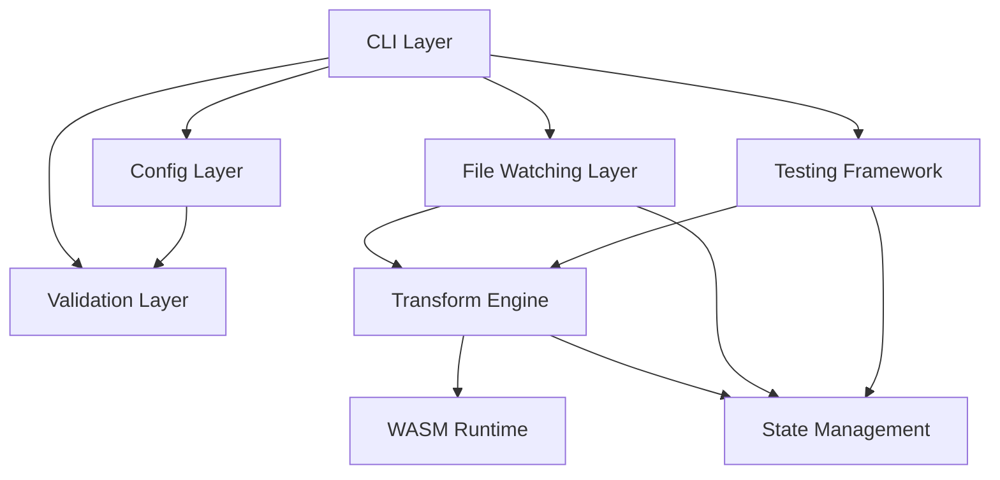
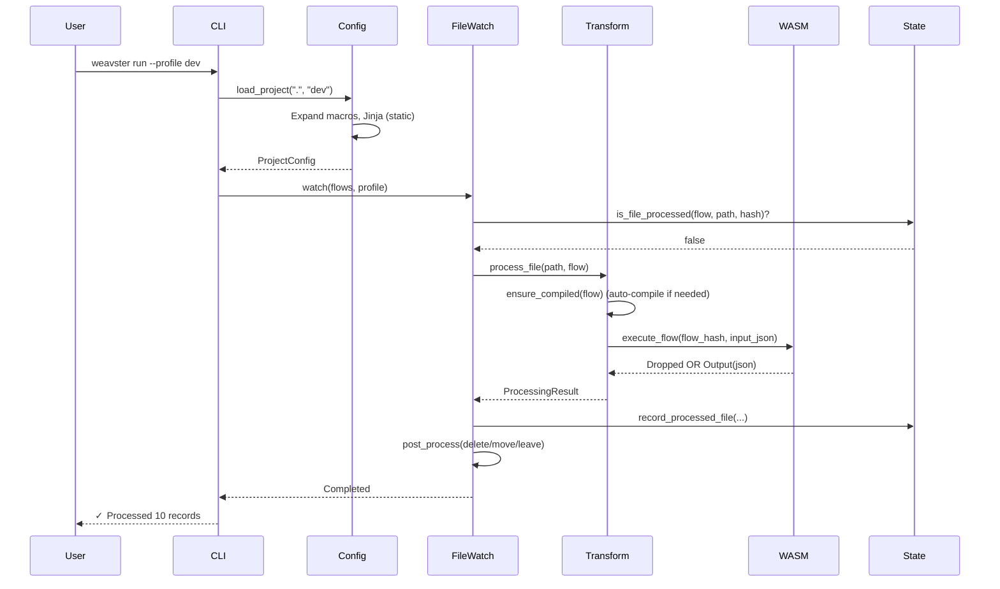
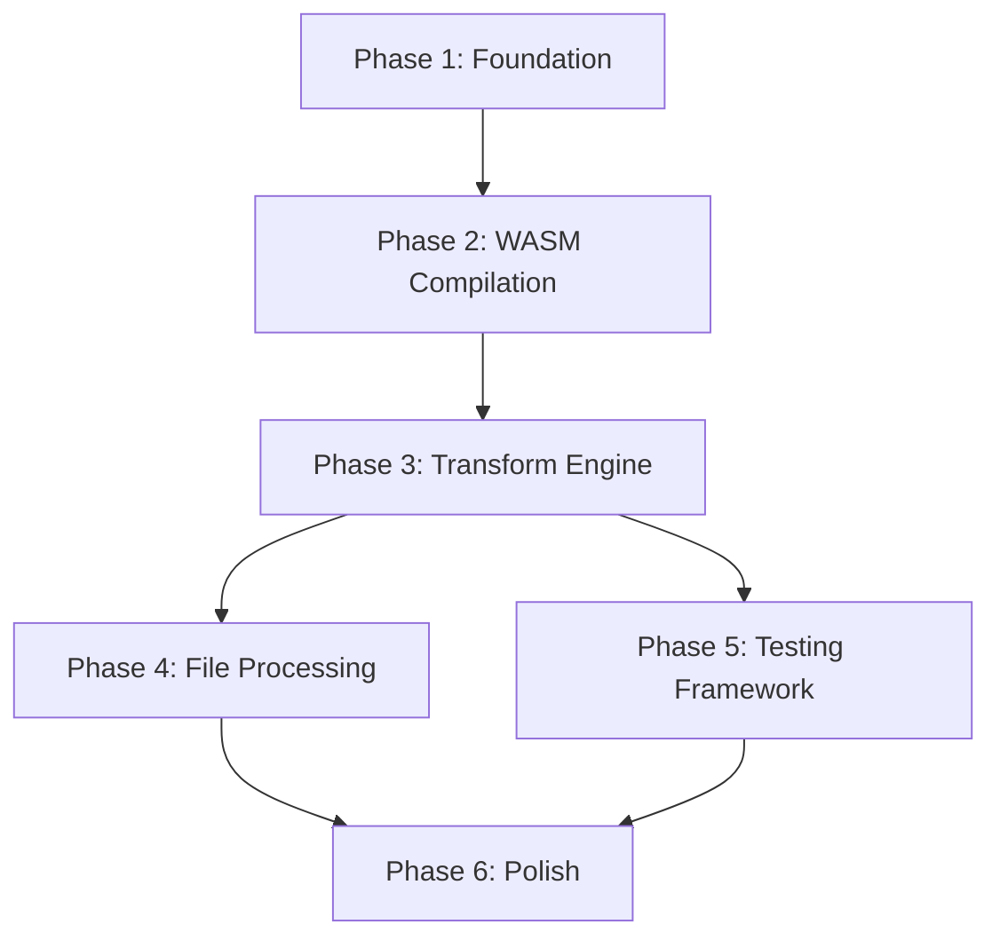

# Technical Plan: Weavster MVP Architecture

## Architectural Approach

### Core Architectural Decisions

**1. Runtime WASM Compilation Strategy (wasm32-wasip2 + std)**

The MVP uses **runtime WASM compilation** with Cargo as a developer requirement. Flows are compiled to **`wasm32-unknown-unknown`** (pure compute) and executed via wasmtime in a locked-down WASI sandbox.

**Key decisions:**
- **Target:** `wasm32-unknown-unknown` (avoids WASI Preview 2 `wasip2` stability issues and missing `std` stubs for the MVP)
- **Generated code:** uses **`std`** (we explicitly do *not* optimize for `no_std` in MVP)
- **Compilation mode:** hybrid — `weavster compile` is explicit; `weavster run` auto-compiles if missing/stale
- **Cache:** filesystem only in `.weavster/cache/` (gitignored)
- **Failure policy:** **fail fast** on compilation errors (user must fix)
- **Execution model:** WASM-only (no interpreter fallback)

**ABI standardization (for chaining + debugability):**
- Generated modules expose a **simple alloc-style ABI** (return pointer/len or equivalent), rather than the current pointer+capacity ABI in `file:crates/weavster-codegen/src/generator.rs`.
- Filters are first-class **boolean transforms** (matchers). A false result **drops the record from the pipeline** immediately.
- WASM execution is intended to be **idempotent**; host-provided metadata (e.g., timestamps) is passed in explicitly as input metadata rather than calling clocks from WASM.

**Trade-offs:**
- ✅ Full pipeline proven: YAML → codegen → WASM compile → WASM execution
- ✅ Easier chaining and debugging with the simpler ABI
- ✅ Can support a growing transform DSL without host-side special-cases
- ❌ Requires Rust toolchain on developer machines
- ❌ First-run cost includes compilation latency

**Implementation:**
- Compile per-flow to WASM: `weavster compile [--flow X]`
- Auto-compile on run if stale/missing: `weavster run` (same cache key strategy)
- Cache invalidation via content hash of flow + referenced artifacts
- Update codegen compilation target from `wasm32-wasi` → **`wasm32-unknown-unknown`** (and ensure the target is installed). Use `opt-level = 0` or Cranelift for ultra-fast developer feedback loops.
- Standardize the generated temp-crate dependency set (serde_json + regex + minijinja + once_cell + phf) to avoid conditional Cargo.toml generation. Ensure temp crates share a unified `target/` directory to reuse compiled dependencies.
- **Compile unit:** exactly **one WASM module per flow** (simplifies caching, improves performance, avoids host-side chain complexity)

**2. Hybrid Jinja Evaluation**

Jinja templates are evaluated at two stages for maximum flexibility:

**Load-Time Evaluation (Static):**
- Global variables from `weavster.yaml`
- Profile-specific configuration
- Environment variables
- Macro expansion

**Runtime Evaluation (Dynamic):**
- Per-message values: `{{ now() }}`, `{{ message.field }}`
- Conditional logic based on message data
- Dynamic field names

**Trade-offs:**
- ✅ **Pro:** Maximum flexibility - static config + dynamic values
- ✅ **Pro:** Performance - static values computed once
- ❌ **Con:** More complex than single-stage evaluation
- ❌ **Con:** Need to distinguish static vs dynamic templates

**Implementation:**
- Use `minijinja` (already in workspace dependencies)
- Two-pass rendering: config load → static context, message processing → dynamic context
- **Crucial:** Implement strict validation to ensure users don't accidentally use runtime syntax (`{{ message.field }}`) inside load-time configurations (like connector DB URLs), avoiding runtime resolution panics.
- Clear documentation on which contexts are available where

**3. Sequential File Processing (per flow)**

File watching processes files one at a time **per flow**, queuing concurrent arrivals.

**Trade-offs:**
- ✅ **Pro:** Simple, predictable behavior per flow
- ✅ **Pro:** Easier to debug and reason about
- ✅ **Pro:** Avoids per-flow resource contention issues
- ❌ **Con:** Slower for high-volume scenarios within a single flow
- ✅ **Mitigation:** Scale by running multiple flows concurrently (see Bridge scheduling)

**Implementation:**
- Use `notify` crate for filesystem watching + periodic glob rescan
- Maintain an in-memory queue of pending files per flow
- Process each flow’s file queue sequentially
- Track processed files in server DB using (flow_name, file_path, file_hash)
- Default cadence: ~5000ms; configurable down to ~500ms

**3b. Bridge Scheduling & Flow Concurrency**

Bridges are persisted queues that connect flows. To avoid stalls (producer runs forever while consumer never gets CPU), MVP server mode runs flows concurrently.

**MVP scheduling decision:**
- **Server mode:** one async task per flow (each with its own input poll loop)
- **Within a flow:** sequential record processing by default
- **Bridge consumers:** poll `bridge_messages` for ready messages, lease via lock fields, and ack by marking done
- **Scaling later:** configurable worker concurrency per bridge/connector and horizontal scaling via multiple server instances (still at-least-once)

**4. Comprehensive Server State Management (sqlx)**

We persist state for **server mode** in a relational DB: SQLite for dev server and Postgres for prod server, managed natively via `sqlx`.

**State Categories:**
- **File Tracking:** which (flow, path, hash) have been processed
- **Execution History:** flow runs, counts, timing
- **Test Results:** test outcomes and diffs (optional persistence)
- **Bridge Queue:** persisted “bridge connector” messages for flow chaining / fan-in
- **Cache:** WASM artifacts remain filesystem-based under `.weavster/cache/`

**Trade-offs:**
- ✅ **Pro:** Enables persisted bridges, replays, and restart safety
- ✅ **Pro:** `sqlx` is fully async-native and avoids `spawn_blocking` bottlenecks
- ✅ **Pro:** Migrations can be compiled into the binary, adhering to the Single Binary Distribution goal
- ❌ **Con:** Adds operational/state complexity (migrations, schema)

**Implementation:**
- Commit to **sqlx** natively (SQLite + Postgres backends)
- Compile migrations directly into the Weavster binary to avoid shipping external CLI tools
- DB used for server runtime state only
- Developer artifacts (cache/logs/profiles/test logs) remain repo-local under `.weavster/` (dbt-like)
- Automatically run migrations on startup (or provide an explicit `weavster migrate`)

**5. CLI-First Validation, LSP-Ready**

Build validation as a library that CLI uses directly, designed for future LSP integration.

**Trade-offs:**
- ✅ **Pro:** Fast to implement for MVP
- ✅ **Pro:** Library design makes LSP refactor straightforward
- ✅ **Pro:** Validation logic is reusable
- ❌ **Con:** Not true LSP in MVP (no real-time IDE integration)
- ❌ **Con:** Post-MVP: Wrap library in tower-lsp server

**Implementation:**
- Core validation library with structured error types
- CLI invokes library, formats output for terminal
- Validation categories: YAML syntax, schema, references, logic
- Use existing validators (serde_yaml, jsonschema) + custom Weavster logic

**6. Hybrid Testing Framework**

In-memory execution for unit tests (fast), file-based for integration tests (full pipeline).

**Trade-offs:**
- ✅ **Pro:** Fast feedback for unit tests
- ✅ **Pro:** Integration tests validate full pipeline
- ✅ **Pro:** Best of both worlds
- ❌ **Con:** Two execution paths to maintain
- ❌ **Con:** Need clear documentation on when to use which

**Implementation:**
- Test runner detects test type from YAML config
- Unit tests: Load fixtures → execute transforms in-memory → assert
- Integration tests: Write temp files → run flow → read output → compare
- Diff output for failures (similar to dbt test output)

---

## Data Model

### Database Schema

The system uses a relational database for **server mode** state (SQLite for dev server, Postgres for prod server). Schema is managed via **sqlx migrations**. Developer artifacts (WASM cache, logs, profiles) remain repo-local under `.weavster/` (dbt-like).

**Core Tables:**

```sql
-- Track processed files to prevent reprocessing
CREATE TABLE processed_files (
    id INTEGER PRIMARY KEY,
    file_path TEXT NOT NULL,
    file_hash TEXT NOT NULL,  -- SHA256 of file content
    flow_name TEXT NOT NULL,
    processed_at TIMESTAMP NOT NULL DEFAULT CURRENT_TIMESTAMP,
    status TEXT NOT NULL,  -- 'success', 'failed', 'skipped'
    records_processed INTEGER NOT NULL DEFAULT 0,
    records_failed INTEGER NOT NULL DEFAULT 0,
    error_message TEXT,
    -- Reprocess when content changes at same path
    UNIQUE(flow_name, file_path, file_hash)
);

-- Bridge queue (persisted) for chaining flows / fan-in patterns
CREATE TABLE bridge_messages (
    id INTEGER PRIMARY KEY,
    bridge_name TEXT NOT NULL,
    message_id TEXT NOT NULL, -- stable id used for dedupe + replay semantics
    created_at TIMESTAMP NOT NULL DEFAULT CURRENT_TIMESTAMP,
    available_at TIMESTAMP NOT NULL DEFAULT CURRENT_TIMESTAMP,

    -- leasing/locking for at-least-once delivery
    locked_at TIMESTAMP,
    lock_owner TEXT,
    lock_expires_at TIMESTAMP,

    payload_json TEXT NOT NULL,
    metadata_json TEXT,

    status TEXT NOT NULL DEFAULT 'ready', -- ready|processing|done|failed|dead
    attempts INTEGER NOT NULL DEFAULT 0,
    error_message TEXT,

    UNIQUE(bridge_name, message_id)
);

CREATE INDEX idx_bridge_ready ON bridge_messages(bridge_name, status, available_at);
CREATE INDEX idx_bridge_lock ON bridge_messages(bridge_name, lock_expires_at);

-- Track flow execution history
CREATE TABLE flow_executions (
    id INTEGER PRIMARY KEY,
    flow_name TEXT NOT NULL,
    started_at TIMESTAMP NOT NULL DEFAULT CURRENT_TIMESTAMP,
    completed_at TIMESTAMP,
    status TEXT NOT NULL,  -- 'running', 'completed', 'failed'
    records_processed INTEGER NOT NULL DEFAULT 0,
    records_failed INTEGER NOT NULL DEFAULT 0,
    error_message TEXT,
    profile TEXT,  -- 'dev', 'prod', etc.
    INDEX idx_flow_started (flow_name, started_at)
);

-- Track test results
CREATE TABLE test_results (
    id INTEGER PRIMARY KEY,
    test_name TEXT NOT NULL,
    flow_name TEXT NOT NULL,
    executed_at TIMESTAMP NOT NULL DEFAULT CURRENT_TIMESTAMP,
    passed BOOLEAN NOT NULL,
    duration_ms INTEGER NOT NULL,
    error_message TEXT,
    diff_output TEXT,  -- JSON diff for failed assertions
    INDEX idx_test_flow (test_name, flow_name)
);

-- Note: WASM cache is filesystem-based (.weavster/cache/), not in database
```

**Relationships:**
- `processed_files.flow_name` → references flow configuration
- `flow_executions.flow_name` → references flow configuration
- `test_results.flow_name` → references flow configuration
- One flow can have many executions, processed files, and test results

**Data Access Patterns:**
- **File watching:** Check if file already processed: `SELECT * FROM processed_files WHERE flow_name = ? AND file_path = ? AND file_hash = ?`
- **Bridge dequeue (at-least-once):** select ready messages; atomically lease via lock_owner + lock_expires_at
- **Execution history:** Recent runs: `SELECT * FROM flow_executions WHERE flow_name = ? ORDER BY started_at DESC LIMIT 10`
- **Test results:** Test history: `SELECT * FROM test_results WHERE test_name = ? ORDER BY executed_at DESC`
- **Cache lookup:** Check filesystem: `.weavster/cache/{flow_hash}.wasm`

**Bridge contract (MVP):**
- Delivery is **at-least-once**.
- Each bridge message has a stable `message_id` for idempotency/deduping and for controlled replays.
- Replay is supported by resetting status/availability for selected `message_id`s (implementation detail depends on server tooling).

**Migration Strategy:**
- Use sqlx migrations (compiled into the binary)
- Automatic migration on startup for dev server (SQLite)
- Explicit migration command for prod server: `weavster migrate` (or auto-migrate)
- DB is for server mode; repo-local artifacts stay in `.weavster/`

---

## Component Architecture

### High-Level Component Diagram



### Component Descriptions

**1. CLI Layer**

Handles user commands and orchestrates other components.

**Responsibilities:**
- Parse command-line arguments (using `clap`)
- Route to appropriate command handlers
- Format output for terminal (colors, progress bars)
- Handle Ctrl+C gracefully

**Key Commands:**
- `init` - Create new project structure
- `validate` - Validate configuration files
- `test` - Run test suite
- `run` - Execute flows (with --profile, --preview, --limit flags)
- `list` - List transforms, connectors, flows

**Integration Points:**
- Calls Config Layer to load project configuration
- Calls Validation Layer for `validate` command
- Calls Testing Framework for `test` command
- For `run`: starts the runtime scheduler
  - File-based flows use the File Watching layer as the input driver
  - Bridge-based flows use DB polling/leasing as the input driver
  - Flows run concurrently in server mode (one task per flow)

---

**2. Config Layer**

Loads and processes YAML configuration files with Jinja templating and macro expansion.

**Responsibilities:**
- Load `weavster.yaml`, flows, connectors, macros
- Expand Jinja templates (load-time static evaluation)
- Expand macros inline (load-time)
- Resolve profile-specific overrides
- Provide structured config objects to other layers

**Processing Pipeline:**
```
YAML Files → Parse → Expand Macros → Expand Jinja (static) → Validate Schema → Config Objects
```

**Key Interfaces:**
```rust
pub struct ConfigLoader {
    pub fn load_project(path: &Path, profile: &str) -> Result<ProjectConfig>;
    pub fn load_flows(base_path: &Path) -> Result<Vec<Flow>>;
    pub fn load_macros(base_path: &Path) -> Result<HashMap<String, Macro>>;
}
```

**Integration Points:**
- Used by all other components to access configuration
- Integrates with Validation Layer for schema validation
- Provides context for Jinja runtime evaluation

---

**3. Validation Layer**

Validates configuration files for correctness.

**Responsibilities:**
- YAML syntax validation (via `serde_yaml`)
- Schema validation (required fields, types)
- Reference validation (connectors, flows, macros exist)
- Logical validation (no circular dependencies, unreachable transforms)
- Jinja template syntax validation
- **Filter validation:** enforce **structured matcher-only** filters (expression strings are rejected in MVP)
- **WASM readiness checks:** verify flow can be compiled (e.g., no unsupported transform variants for MVP)

**Validation Categories:**
- **Syntax:** Malformed YAML, invalid Jinja
- **Schema:** Missing required fields, wrong types
- **References:** Non-existent connectors, flows, macros
- **Logic:** Circular macro references, unreachable transforms

**Output Format:**
```rust
pub struct ValidationError {
    pub file: PathBuf,
    pub line: usize,
    pub column: usize,
    pub severity: Severity,  // Error, Warning, Info
    pub message: String,
    pub suggestion: Option<String>,
}
```

**Integration Points:**
- Called by CLI for `validate` command
- Called by Config Layer during load
- Future: Wrapped by LSP server for IDE integration

---

**4. Transform Engine**

Executes flow pipelines by running **compiled-per-flow WASM modules** (built via `weavster compile` or auto-compiled on-demand). The engine is responsible for transform chaining and for enforcing filter semantics.

**Responsibilities:**
- Resolve a flow → locate its compiled WASM in `.weavster/cache/` (or compile if missing/stale)
- Initialize and reuse wasmtime runtime with a **locked-down WASI context** (no FS/env/net)
- Execute the flow pipeline per record
- Enforce **filter-as-matcher** semantics: when a filter returns false, **drop the record** (stop processing remaining transforms/outputs for that record)
- Apply hierarchical error handling policies (global → flow → transform)
- Pass host-provided metadata (e.g., timestamps) into WASM explicitly to keep transforms idempotent

**Execution Flow:**
```
Message → Ensure Flow WASM Available → Execute Flow WASM → (Drop | Output Message)
```

**WASM Module Interface (MVP target contract):**
- A simple alloc-style ABI suitable for chaining and debugging.
- Modules export an allocator and a transform entrypoint; the host passes JSON bytes and receives JSON bytes (or a “dropped” indicator).

(Exact function names can be finalized during implementation, but the critical requirement is: **no pointer+capacity output buffer ABI**.)

**Integration Points:**
- Called by File Watching Layer (file connector) and by the Bridge connector runtime
- Called by Testing Framework for unit/integration test execution
- Uses State Management for execution tracking (server mode)
- Uses Config Layer for error handling policies

---

**5. File Watching Layer**

Monitors directories for new files and processes them through flows.

**Responsibilities:**
- Watch directories using `notify` and periodically rescan globs
- Expand glob patterns to discover existing files on startup
- Queue files for **sequential** processing per flow
- Avoid partially-written files via **stability debounce** (wait until size/mtime stable)
- Use a configurable scan cadence (default ~5000ms; configurable down to ~500ms)
- Track processed files using (flow_name, file_path, file_hash)
- Apply post-processing actions with sensible defaults:
  - Default: consume/delete input file after successful processing
  - Optional: move to processed/failed directories
  - Exception: tests never delete fixtures

**Processing Flow:**
```
Startup Scan → Debounce → Process → Post-Process → Record State → Watch + Periodic Rescan
```

**Glob Pattern Handling:**
```rust
pub struct FileWatcher {
    pub fn watch(pattern: &str, flow: &Flow) -> Result<()>;
    pub fn process_file(path: &Path, flow: &Flow) -> Result<ProcessingResult>;
}
```

**Integration Points:**
- Uses Transform Engine to execute flows
- Uses State Management to track processed files
- Uses Config Layer for post-processing policies

---

**6. Testing Framework**

Runs tests defined in YAML with file-based fixtures.

**Responsibilities:**
- Load test definitions from `tests/` directory
- Execute tests (in-memory or file-based)
- Compare actual vs expected output
- Validate assertions (record_count, field_exists, etc.)
- Generate diff output for failures

**Test Execution Modes:**
- **Unit Tests (In-Memory):** Fast, focused on transform logic. *Executes the compiled WASM module* in-memory to ensure ABI guarantees, rather than just invoking native Rust structs.
- **Integration Tests (File-Based):** Full pipeline validation

**Test Definition Schema:**
```yaml
name: test_customer_enrichment
flow: customer_enrichment
mode: unit  # or 'integration'
input: ./tests/fixtures/input.jsonl
expected_output: ./tests/fixtures/expected.jsonl
assertions:
  - record_count: 5
  - field_exists: full_name
  - field_not_exists: first_name
```

**Integration Points:**
- Uses Transform Engine for execution
- Uses State Management to record test results
- Uses Config Layer to load flow configuration

---

**7. State Management**

Abstracts database operations for **server mode** using `sqlx`, supporting SQLite (dev server) and Postgres (prod server).

**Responsibilities:**
- Provide unified interface for server-state operations (processed files, executions, test results, and bridge queues)
- Handle sqlx migrations built directly into the binary
- Manage connection pooling
- Support both SQLite (dev server) and Postgres (prod server)
- `sqlx` inherently handles async runtime natively without `spawn_blocking` overhead
- Keep non-server developer artifacts out of the DB (cache/logs/profiles live under `.weavster/`)

**Key Interfaces:**
```rust
pub trait StateStore {
    async fn record_processed_file(&self, file: ProcessedFile) -> Result<()>;
    async fn is_file_processed(&self, path: &Path, flow: &str) -> Result<bool>;
    async fn record_execution(&self, exec: FlowExecution) -> Result<()>;
    async fn record_test_result(&self, result: TestResult) -> Result<()>;
}

pub struct SqliteStore { ... }
pub struct PostgresStore { ... }
```

**Integration Points:**
- Used by File Watching Layer for file tracking
- Used by Transform Engine for execution history
- Used by Testing Framework for test results
- Profile-based selection (dev → SQLite, prod → Postgres)

---

**8. WASM Runtime**

Manages wasmtime runtime and **per-flow module execution** (compiled to `wasm32-unknown-unknown`).

**Responsibilities:**
- Initialize a reusable wasmtime `Engine` configured for standard module execution (or WASI Preview 1 if absolutely needed for compute fallbacks).
- Create a **locked-down WASI context** for each execution (no FS/env/net; deterministic execution)
- Load compiled flow modules from the filesystem cache (`.weavster/cache/`), with an in-memory module cache keyed by flow hash
- Bridge the host↔WASM boundary using the **simple alloc-style ABI** (allocate input, call transform, read output, free)
- Enforce execution limits (fuel / timeout / memory limits) as a safety boundary

**Runtime Interface (conceptual):**
```rust
pub struct WasmRuntime {
    engine: wasmtime::Engine,
    module_cache: HashMap<String, wasmtime::Module>, // flow_hash -> module
}

impl WasmRuntime {
    pub fn load_flow_module(&mut self, flow_hash: &str, wasm_path: &Path) -> Result<()>;
    pub fn execute_flow(&self, flow_hash: &str, input_json: &[u8]) -> Result<FlowWasmResult>;
}

pub enum FlowWasmResult {
    Dropped,
    Output(Vec<u8>),
}
```

**Integration Points:**
- Used by Transform Engine for flow execution
- Receives compiled WASM locations from the compilation/cache layer
- Provides the sandbox boundary (WASM cannot directly access DB, FS, or network)

---

### End-to-End Request Flow

**Scenario: User runs `weavster run --profile dev`**



---

---

## Error Handling Strategy

### Per-Component Error Handling

**1. CLI Layer Errors**

**Failure Scenarios:**
- Invalid command-line arguments
- Missing required flags
- Invalid project path
- Ctrl+C during execution

**Handling:**
- Show usage help for invalid arguments
- Graceful shutdown on Ctrl+C (flush buffers, close connections)
- Clear error messages with suggestions
- Exit codes: 0 (success), 1 (user error), 2 (system error)

---

**2. Config Layer Errors**

**Failure Scenarios:**
- Missing `weavster.yaml`
- Malformed YAML syntax
- Invalid Jinja templates
- Circular macro references
- Missing connector/flow files
- Profile not found

**Handling:**
- **Fail Fast:** Stop on first error, don't attempt to continue
- **Detailed Context:** Show file path, line number, column
- **Suggestions:** "Did you mean 'dev' instead of 'dve'?"
- **Validation:** Run validation before attempting to load

**Example Error:**
```
Error: Failed to load configuration
  File: flows/customer.yaml:12:5
  Error: Unknown transform 'mapp' (did you mean 'map'?)

  Suggestion: Run 'weavster validate' to check all configs
```

---

**3. Validation Layer Errors**

**Failure Scenarios:**
- Schema violations (missing required fields)
- Type mismatches (string where number expected)
- Reference errors (non-existent connector)
- Logical errors (circular dependencies)
- Invalid Jinja syntax

**Handling:**
- **Collect All Errors:** Don't stop at first error, show all issues
- **Severity Levels:** Error (blocking), Warning (non-blocking), Info (suggestions)
- **Structured Output:** Machine-readable for LSP, human-readable for CLI
- **Exit Code:** Non-zero if any errors found

**Example Output:**
```
✗ 3 errors, 1 warning found

Error: flows/customer.yaml:15:3
  Missing required field 'input'

Error: flows/customer.yaml:20:5
  Connector 'kafka.orders' not found
  Available: file.input, file.output

Warning: flows/customer.yaml:25:5
  Transform 'drop' has no effect (no fields specified)
```

---

**4. Transform Engine Errors**

**Failure Scenarios:**
- WASM compilation failure
- WASM execution timeout
- WASM runtime error (panic, trap)
- Invalid transform output
- Memory limit exceeded

**Handling:**
- **Compilation Errors:** Fail fast, show Rust compiler output
- **Runtime Errors:** Apply error handling policy (log-and-skip or stop-on-error)
- **Timeouts:** Configurable per-transform, kill WASM instance
- **Memory Limits:** Wasmtime memory limits prevent runaway processes

**Example Compilation Error:**
```
Error: Failed to compile flow 'customer_enrichment'

  Compilation failed with 2 errors:

  error[E0425]: cannot find value `fieldd` in this scope
   --> generated.rs:15:20
    |
  15 |     let value = input.fieldd;
     |                    ^^^^^^ help: a field with a similar name exists: `field`

  This error was caused by transform at flows/customer.yaml:18:5

  Suggestion: Check field name spelling in your flow configuration
```

---

**5. File Watching Layer Errors**

**Failure Scenarios:**
- Permission denied on directory
- File deleted while processing
- Filesystem watcher crashes
- Glob pattern matches no files
- Post-processing failure (can't move/delete file)

**Handling:**
- **Retry Logic:** Retry file operations with exponential backoff
- **Graceful Degradation:** Log error, continue watching
- **Re-establish Watch:** If watcher crashes, attempt to restart
- **Skip Problematic Files:** Log error, move to next file

**Example Error:**
```
Warning: Failed to process file 'data/input/corrupted.jsonl'
  Error: Permission denied (os error 13)

  Action: Skipping file, will retry on next watch cycle

  Suggestion: Check file permissions or exclude from glob pattern
```

---

**6. Testing Framework Errors**

**Failure Scenarios:**
- Test fixture file not found
- Invalid test YAML
- Assertion failure
- Flow execution error during test
- Output mismatch

**Handling:**
- **Fail Fast:** Stop test suite on first failure (default)
- **Continue Mode:** `--continue` flag runs all tests, reports all failures
- **Detailed Diff:** Show expected vs actual with line-by-line comparison
- **Exit Code:** Non-zero if any tests fail

**Example Test Failure:**
```
✗ test_customer_enrichment FAILED (0.15s)

  Assertion failed: field_exists 'full_name'

  Expected output to contain field 'full_name' in all records
  Found missing in record 3:

  Expected:
    {"full_name": "John Doe", "email": "john@example.com"}

  Actual:
    {"email": "john@example.com"}

  Diff:
    - full_name: "John Doe"
```

---

**7. State Management Errors**

**Failure Scenarios:**
- Database connection failure
- Migration failure
- Disk full (SQLite)
- Transaction deadlock
- Corrupted database

**Handling:**
- **Connection Retry:** Exponential backoff, max 3 attempts
- **Migration Validation:** Check migrations before applying
- **Graceful Degradation:** In-memory queue preserves pending work
- **Backup:** Auto-backup SQLite before migrations

**Example Error:**
```
Error: Database connection failed

  Failed to connect to SQLite database at .weavster/data/state.db
  Error: database is locked (os error 5)

  Retrying in 1s... (attempt 1/3)
  Retrying in 2s... (attempt 2/3)
  Retrying in 4s... (attempt 3/3)

  Failed after 3 attempts. Exiting.

  Suggestion: Check if another weavster process is running
```

---

**8. WASM Runtime Errors**

**Failure Scenarios:**
- Module load failure
- Function not found
- Type mismatch (invalid input/output)
- Trap (divide by zero, out of bounds)
- Out of memory

**Handling:**
- **Fail Fast:** WASM errors are unrecoverable, stop flow
- **Detailed Context:** Show which transform, which message
- **Sandbox Isolation:** WASM errors don't crash main process
- **Logging:** Full stack trace for debugging

**Example Error:**
```
Error: WASM execution failed

  Transform: map (flows/customer.yaml:15:3)
  Message: Record 42 from data/input.jsonl

  WASM trap: integer divide by zero
    at transform::execute (generated.wasm:0x1a3f)

  Input data:
    {"total": 100, "quantity": 0}

  Suggestion: Check for division by zero in transform logic
```

---

### Failure Modes and Recovery

**File Processing Failure:**
- **Failure:** Transform throws error on message
- **Recovery:** Apply error handling policy (log-and-skip or stop-on-error)
- **State:** Record failure in `processed_files` table with error message
- **User Impact:** Logged error, flow continues or stops based on policy

**Database Connection Failure:**
- **Failure:** SQLite/Postgres connection lost
- **Recovery:** Retry with exponential backoff (configurable)
- **State:** In-memory queue preserves pending files
- **User Impact:** Warning logged, processing pauses until reconnect

**WASM Execution Timeout:**
- **Failure:** Transform takes too long (configurable timeout)
- **Recovery:** Kill WASM instance, log error, apply error handling policy
- **State:** Record as failed message
- **User Impact:** Error logged, message skipped or flow stopped

**File Watching Failure:**
- **Failure:** `notify` crate error (permissions, filesystem issues)
- **Recovery:** Log error, attempt to re-establish watch
- **State:** No state change
- **User Impact:** Warning logged, may miss files until recovery

---

## Testing Strategy

### Per-Component Testing Approach

**1. CLI Layer Testing**

**Unit Tests:**
- Argument parsing (valid/invalid combinations)
- Help text generation
- Error message formatting
- Exit code correctness

**Integration Tests:**
- End-to-end command execution (`weavster init`, `weavster run`)
- Ctrl+C handling
- Output formatting (colors, progress bars)

**Tools:** `assert_cmd`, `predicates` crates

**Example:**
```rust
#[test]
fn test_init_creates_project_structure() {
    let temp = tempdir().unwrap();
    Command::cargo_bin("weavster")
        .arg("init")
        .arg(temp.path())
        .assert()
        .success();

    assert!(temp.path().join("weavster.yaml").exists());
    assert!(temp.path().join("flows").exists());
}
```

---

**2. Config Layer Testing**

**Unit Tests:**
- YAML parsing (valid/invalid syntax)
- Jinja expansion (static and dynamic contexts)
- Macro expansion (simple and nested)
- Profile resolution
- Error handling (missing files, circular refs)

**Integration Tests:**
- Load complete project configuration
- Profile switching
- Environment variable substitution

**Tools:** `tempfile` for test fixtures, `rstest` for parameterized tests

**Example:**
```rust
#[rstest]
#[case("valid_flow.yaml", true)]
#[case("invalid_syntax.yaml", false)]
fn test_flow_parsing(#[case] fixture: &str, #[case] should_succeed: bool) {
    let result = ConfigLoader::load_flow(fixture);
    assert_eq!(result.is_ok(), should_succeed);
}
```

---

**3. Validation Layer Testing**

**Unit Tests:**
- Schema validation (each rule independently)
- Reference validation (connector/flow/macro existence)
- Logical validation (circular dependencies)
- Error message quality

**Integration Tests:**
- Validate complete projects (valid and invalid)
- Multiple error collection
- Severity level assignment

**Tools:** JSON Schema test suite, custom fixtures

**Example:**
```rust
#[test]
fn test_detects_missing_required_field() {
    let yaml = r#"
        name: test_flow
        # missing 'input' field
        outputs:
          - file.output
    "#;

    let errors = Validator::validate_flow(yaml).unwrap_err();
    assert!(errors.iter().any(|e| e.message.contains("Missing required field 'input'")));
}
```

---

**4. Transform Engine Testing**

**Unit Tests:**
- Each transform type (map, drop, add_fields, filter)
- Error handling policies
- Jinja runtime evaluation
- WASM module loading

**Integration Tests:**
- Transform chains (multiple transforms in sequence)
- Error propagation
- Performance benchmarks

**Tools:** `criterion` for benchmarks, custom WASM test modules

**Example:**
```rust
#[test]
fn test_map_transform() {
    let input = json!({"first_name": "John", "last_name": "Doe"});
    let transform = MapTransform { map: hashmap!{"name" => "first_name"} };

    let output = transform.execute(&input).unwrap();
    assert_eq!(output["name"], "John");
}
```

---

**5. File Watching Layer Testing**

**Unit Tests:**
- Glob pattern matching
- File hash calculation
- Post-processing actions (move/delete/leave)
- Queue management

**Integration Tests:**
- Watch directory, add files, verify processing
- Handle file deletion during processing
- Concurrent file arrivals (sequential processing)

**Tools:** `tempfile`, `notify` test utilities

**Example:**
```rust
#[tokio::test]
async fn test_processes_new_files() {
    let temp = tempdir().unwrap();
    let watcher = FileWatcher::new(temp.path(), "*.jsonl");

    // Add file
    std::fs::write(temp.path().join("test.jsonl"), "{}").unwrap();

    // Wait for processing
    tokio::time::sleep(Duration::from_millis(100)).await;

    // Verify processed
    assert!(watcher.is_processed("test.jsonl"));
}
```

---

**6. Testing Framework Testing**

**Unit Tests:**
- Test definition parsing
- Assertion evaluation (each assertion type)
- Diff generation
- Test result recording

**Integration Tests:**
- Run complete test suites
- Verify test isolation
- Check exit codes

**Tools:** Meta-testing (tests that test the test framework)

**Example:**
```rust
#[test]
fn test_assertion_field_exists() {
    let output = json!({"name": "John"});
    let assertion = Assertion::FieldExists("name");

    assert!(assertion.evaluate(&output).is_ok());

    let assertion = Assertion::FieldExists("age");
    assert!(assertion.evaluate(&output).is_err());
}
```

---

**7. State Management Testing**

**Unit Tests:**
- Database operations (CRUD)
- Migration application
- Connection pooling
- Transaction handling

**Integration Tests:**
- SQLite and Postgres compatibility
- Concurrent access
- Migration rollback

**Tools:** `sqlx` test utilities, in-memory SQLite

**Example:**
```rust
#[sqlx::test]
async fn test_record_processed_file(pool: PgPool) {
    let store = PostgresStore::new(pool);

    let file = ProcessedFile {
        path: "test.jsonl",
        flow: "test_flow",
        status: "success",
        ..Default::default()
    };

    store.record_processed_file(&file).await.unwrap();

    assert!(store.is_file_processed("test.jsonl", "test_flow").await.unwrap());
}
```

---

**8. WASM Runtime Testing**

**Unit Tests:**
- Module loading (valid/invalid WASM)
- Function invocation
- Type marshalling (JSON ↔ WASM)
- Error handling (traps, timeouts)

**Integration Tests:**
- Execute real compiled transforms
- Memory limits
- Concurrent execution

**Tools:** `wasmtime` test utilities, pre-compiled test modules

**Example:**
```rust
#[test]
fn test_wasm_execution() {
    let runtime = WasmRuntime::new().unwrap();
    let input = json!({"x": 1});

    let output = runtime.execute("map", &input).unwrap();
    assert!(output.is_object());
}
```

---

## Implementation Phases

### Phase 1: Foundation (Week 1)
**Goal:** Core infrastructure and configuration

**Components:**
1. **Config Layer** (2 days)
   - YAML parsing
   - Jinja expansion (static)
   - Macro expansion
   - Profile resolution
   - Tests: Unit tests for each feature

2. **Validation Layer** (2 days)
   - Schema validation
   - Reference validation
   - Error formatting
   - Tests: Validation test suite

3. **CLI Layer - Basic** (1 day)
   - `init` command
   - `validate` command
   - Help text
   - Tests: CLI integration tests

**Deliverable:** `weavster init` and `weavster validate` work end-to-end

**Dependencies:** None

---

### Phase 2: WASM Compilation (Week 2)
**Goal:** Prove WASM compilation pipeline works

**Components:**
1. **WASM Codegen** (3 days)
   - Enhance existing `file:crates/weavster-codegen`
   - Generate Rust code for transforms
   - Compile to WASM via Cargo
   - Filesystem caching
   - Tests: Codegen unit tests, compilation integration tests

2. **WASM Runtime** (2 days)
   - Initialize wasmtime
   - Load WASM modules
   - Execute transforms
   - Error handling
   - Tests: WASM execution tests

**Deliverable:** `weavster compile` compiles flows to WASM

**Dependencies:** Phase 1 (Config Layer)

---

### Phase 3: Transform Engine (Week 3)
**Goal:** Execute transforms on data

**Components:**
1. **Transform Engine** (3 days)
   - Integrate WASM Runtime
   - Jinja runtime evaluation (dynamic)
   - Error handling policies
   - Message processing pipeline
   - Tests: Transform execution tests

2. **State Management** (2 days)
   - Database abstraction trait
   - SQLite implementation
   - Migrations
   - Tests: Database operation tests

**Deliverable:** Can execute transforms on sample data

**Dependencies:** Phase 2 (WASM Runtime)

---

### Phase 4: File Processing (Week 4)
**Goal:** File watching and processing

**Components:**
1. **File Watching Layer** (3 days)
   - Glob pattern support
   - File watching with `notify`
   - Sequential processing queue
   - Post-processing actions
   - Tests: File watching integration tests

2. **CLI Layer - Run Command** (2 days)
   - `run` command
   - Profile support
   - Progress reporting
   - Ctrl+C handling
   - Tests: End-to-end run tests

**Deliverable:** `weavster run` processes files continuously

**Dependencies:** Phase 3 (Transform Engine, State Management)

---

### Phase 5: Testing Framework (Week 5)
**Goal:** Enable users to test their flows

**Components:**
1. **Testing Framework** (3 days)
   - Test definition parsing
   - Test execution (unit and integration modes)
   - Assertion engine
   - Diff generation
   - Tests: Meta-tests for test framework

2. **CLI Layer - Test Command** (1 day)
   - `test` command
   - Test result reporting
   - Exit codes
   - Tests: Test command integration tests

3. **Documentation** (1 day)
   - Update `weavster init` template with test examples
   - Write testing guide
   - Add to Docusaurus docs

**Deliverable:** `weavster test` runs user-defined tests

**Dependencies:** Phase 3 (Transform Engine)

---

### Phase 6: Polish & Integration (Week 6)
**Goal:** Complete MVP, ready for use

**Components:**
1. **CLI Enhancements** (2 days)
   - `list` commands (transforms, connectors, flows)
   - `--preview` and `--limit` flags for `run`
   - Better error messages
   - Progress bars and colors
   - Tests: CLI UX tests

2. **End-to-End Testing** (2 days)
   - Complete workflow tests
   - Performance benchmarks
   - Error scenario tests
   - Documentation validation

3. **Documentation** (1 day)
   - Complete Docusaurus site
   - Tutorial examples
   - `llm.txt` for LLM consumption
   - README updates

**Deliverable:** Complete MVP ready for internal validation

**Dependencies:** All previous phases

---

### Implementation Dependencies Graph



### Critical Path

The critical path for MVP completion:
1. Config Layer → WASM Codegen → Transform Engine → File Processing → Polish

Testing Framework can be developed in parallel with File Processing.

### Risk Mitigation

**High-Risk Items:**
1. **WASM Compilation Complexity** (Phase 2)
   - Mitigation: Start early, allocate extra time
   - Fallback: Simplify codegen, support fewer transform types

2. **File Watching Reliability** (Phase 4)
   - Mitigation: Extensive testing on different filesystems
   - Fallback: Polling mode if `notify` fails

3. **Performance** (All phases)
   - Mitigation: Benchmark early and often
   - Fallback: Optimize hot paths, add caching

### Success Criteria

MVP is complete when:
- ✅ `weavster init` creates working project
- ✅ `weavster validate` catches configuration errors
- ✅ `weavster compile` compiles flows to WASM
- ✅ `weavster test` runs user tests successfully
- ✅ `weavster run` processes files continuously
- ✅ All 4 transforms (map, drop, add_fields, filter) work
- ✅ SQLite state management works
- ✅ Documentation is complete
- ✅ All tests pass (unit + integration)
