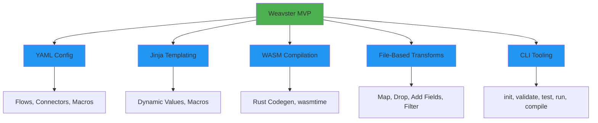
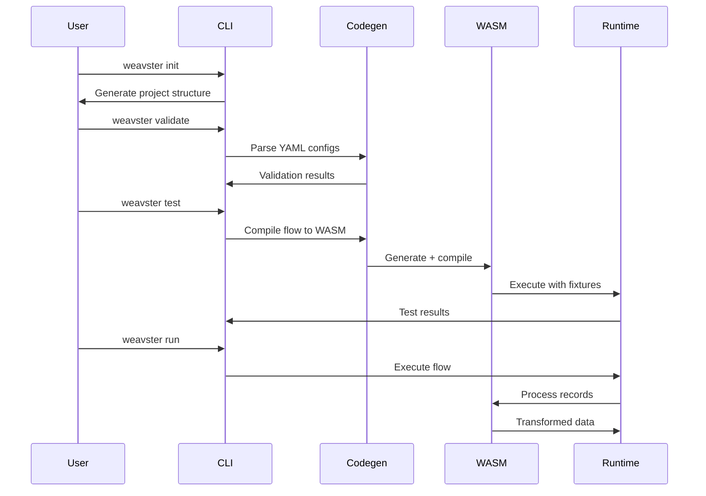

# Weavster Architecture & Design

**Purpose:** High-level strategic guidance for Weavster MVP development
**Audience:** Contributors, LLMs, technical decision-makers
**Scope:** MVP only — local development, YAML config, WASM compilation, file-based transforms
**Companion Docs:** See `plans/mvp-file-transform-pipeline.md` for MVP details, tickets for implementation specifics
**Last Updated:** 2026-02-14

> **Note:** This document reflects the MVP scope. Future versions will include database integration, job queues, OCI packaging, and distributed deployment. See tickets for deferred features.

---

## Vision & Mission

Weavster is **dbt for real-time integration** — a developer-friendly tool for building data transformation pipelines that process records through FIFO queues instead of batch jobs.

**The problem:** Integration engineers waste time on repetitive boilerplate code, have no standardized testing workflow, and are locked into expensive proprietary tools. Healthcare IT teams especially suffer from brittle, untestable HL7/FHIR transformation logic scattered across enterprise middleware.

**Weavster's answer:** YAML-driven transform definitions with Jinja templating, compiled to sandboxed WASM modules. Developers describe *what* transforms to apply, not *how* to execute them.

**MVP success criteria:**
- WASM compilation proof — YAML transforms compile to executable WASM via Rust codegen
- Architecture validation — the crate separation (core/codegen/runtime/cli) supports the pipeline
- DX validation — `weavster init` → `validate` → `test` → `run` feels intuitive

**Out of scope for MVP:**
- Kafka, HTTP, or database connectors
- Multi-format support (CSV, Avro, Parquet)
- Production deployment, Docker images
- OCI packaging and artifact signing



---

## Design Principles

- **LLM-friendly first.** Clear naming conventions, comprehensive `--help` output, predictable file structures. Every error message includes actionable guidance.
- **Local-first development.** Single binary, no external services required. `weavster init && weavster run --once` works out of the box.
- **File-based testing.** All test fixtures are JSONL files in version control. Reproducible, diffable, CI-friendly.
- **Hierarchical configuration.** Global settings in `weavster.yaml`, flow-specific in `flows/*.yaml`, connector definitions in `connectors/*.yaml`. Overrides flow downward.
- **YAGNI enforcement.** No premature abstractions. Inline code over helpers until patterns emerge through actual usage.

---

## Core Concepts

- **Project**: Directory with `weavster.yaml` containing flows, connectors, and configuration
- **Flow**: 1 input → N outputs with transforms in between
- **Connector**: Input/Output adapter (currently: File; future: Kafka, HTTP, etc.)
- **Transform**: Data manipulation (map, drop, add_fields, filter)

> **Deferred transforms:** coalesce, regex, template, lookup — planned for post-MVP.

---

## Architecture Overview

### Transform Pipeline

```
YAML Config → Parse → Rust Codegen → WASM Compile → Execute (wasmtime)
```

All transforms compile to WASM. The YAML transform DSL is parsed into an intermediate representation, translated to Rust, and compiled to WASM. This provides sandboxed execution, portable artifacts, and supply chain security via future OCI signing.

The MVP also includes a native **interpreter** path (`crates/weavster-core/src/interpreter.rs`) that applies transforms directly without WASM compilation, used by `weavster run`.

### Configuration Hierarchy

```
weavster.yaml           # Project config, runtime settings
├── flows/
│   ├── flow_a.yaml     # Individual flow definitions
│   └── flow_b.yaml
├── connectors/
│   └── file.yaml       # Reusable connector configs
└── profiles.yaml       # Environment-specific overrides (future)
```

Connector references use dotted paths: `file.input` resolves to `connectors/file.yaml` key `input`. See `crates/weavster-core/src/config.rs` for config parsing.



---

## Key Technical Decisions

### Rust
Single binary distribution, memory safety without GC, excellent WASM compilation for both host and target, PyO3 for future Python bindings.

### WASM for Transforms
Sandboxed execution, portable artifacts, near-native speed via wasmtime. regex, minijinja, and phf all compile cleanly to WASM. See `crates/weavster-codegen/src/compiler.rs` for implementation.

### MiniJinja
Created by Armin Ronacher (Flask/Jinja creator). Familiar to dbt users, pure Rust, compiles to WASM, no Python dependency.

---

## Current CLI Commands

| Command | Status | Description |
|---------|--------|-------------|
| `init` | MVP | Generate project structure with sample flow and data |
| `run` | MVP | Execute flows via interpreter pipeline |
| `run --once` | MVP | Process all input and exit |
| `validate` | MVP | Check configuration without running |
| `compile` | MVP | Compile flows: YAML → Rust → WASM |
| `test` | Stub | Run flow tests against fixtures |
| `status` | Stub | Show project status |
| `flow list/show/new` | Stub | Manage flows |
| `connector list/test` | Stub | Manage connectors |
| `package` | Future | Create OCI artifact |

See `crates/weavster-cli/src/main.rs` for full command definitions.

---

## Developer Flows

**Flow 1: First-Time Onboarding**
`weavster init` → `validate` → `run --once`
User goes from zero to running example flow in under 5 minutes.

**Flow 2: New Transform Development**
Create `flows/my_flow.yaml` → `validate` → `test` → iterate
Tight feedback loop: edit YAML, validate, test with fixture data.

**Flow 3: Debugging Transforms**
`weavster run --once -v` with `RUST_LOG=debug`
Inspect per-record transform output to diagnose issues.

**Flow 4: WASM Compilation**
`weavster compile` → `compile --debug` (inspect generated Rust)
Verify transforms compile correctly before deployment.

**Flow 5: Testing with Fixtures**
Place JSONL fixtures in `data/` → `weavster test`
File-based, version-controlled, reproducible test runs.

**Flow 6: Configuration Iteration**
Edit `connectors/*.yaml` or `flows/*.yaml` → `validate` → `run --once`
Fast iteration on config changes without full recompile.

**Flow 7: Multi-Flow Projects**
Multiple `flows/*.yaml` files → `weavster run` processes all
Flows execute independently, each with its own input/output connectors.

**Flow 8: Macro Reuse**
Define macros in `macros/*.yaml` → reference with `{{ macro('macro_name') }}` in flows.
Share common transform patterns across flows without duplication.

**Flow 9: Error Handling Hierarchy**
Configure `on_error` at project, flow, or transform level in YAML.
Lower-level settings override higher — e.g., a transform can `skip` while the flow default is `fail`.

**Flow 10: Dev/Prod Profiles**
`weavster run --profile dev` vs `--profile prod` — switch connectors and runtime settings per environment.
Define profiles in `profiles.yaml` with different connector configs, log levels, and batch sizes.

**Flow 11: File Watching & Glob Patterns**
`weavster run --watch` — re-run flows when input files or config changes.
Use glob patterns in file connector paths (e.g., `data/*.jsonl`) to process multiple input files.

---

## Architectural Guardrails

### Workspace Dependency Rules

| Crate | Depends On | Rationale |
|-------|-----------|-----------|
| `weavster-core` | Nothing | Shared library: config, transforms, connectors |
| `weavster-codegen` | `weavster-core` | YAML → Rust → WASM pipeline |
| `weavster-runtime` | `weavster-core` | Execution engine, kept minimal |
| `weavster-cli` | All crates | Developer-facing entry point |

### Boundaries

- **WASM compilation boundary:** Only transform logic compiles to WASM. Connectors, config parsing, and CLI remain native Rust.
- **Error handling:** `thiserror` in library crates (`core`, `codegen`), `anyhow` in application crates (`cli`, `runtime`).
- **Async:** Connector traits use `async_trait` with `Send + Sync` bounds. The interpreter is synchronous.
- **Testing:** Unit tests in `#[cfg(test)]` modules, integration tests in `tests/`, fixtures in `tests/fixtures/`.

### Extension Points

Future features integrate at these boundaries:
- **New connectors:** Implement `InputConnector`/`OutputConnector` traits in `weavster-core/src/connectors.rs`
- **New transforms:** Add variants to `TransformConfig` in `weavster-core/src/config.rs`, implement in `interpreter.rs`
- **Database integration:** Will add to `weavster-runtime` without touching `weavster-core`
- **Job queue:** Will layer on top of `Runtime` in `weavster-runtime/src/engine.rs`

---

## Related Documents

- `plans/mvp-file-transform-pipeline.md` — MVP implementation plan and completion criteria
- `CLAUDE.md` — Development guidelines, coding standards, dependency policy
- `docs/docs/` — User-facing documentation (Docusaurus)
- `crates/weavster-core/src/config.rs` — Config parsing implementation
- `crates/weavster-core/src/interpreter.rs` — Native transform interpreter
- `crates/weavster-codegen/src/compiler.rs` — WASM compilation pipeline
- `crates/weavster-cli/src/main.rs` — CLI command definitions
